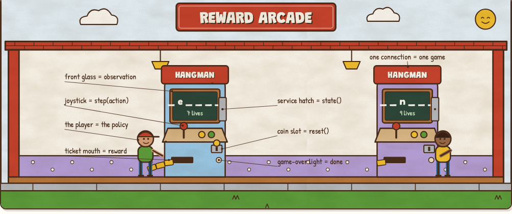
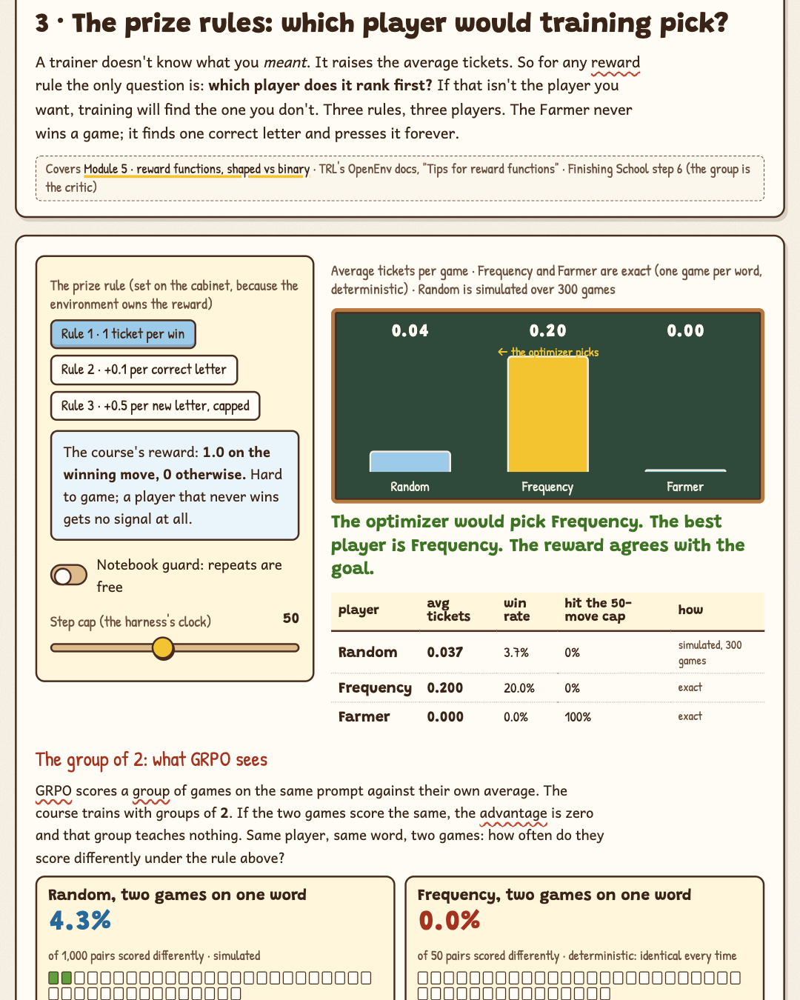
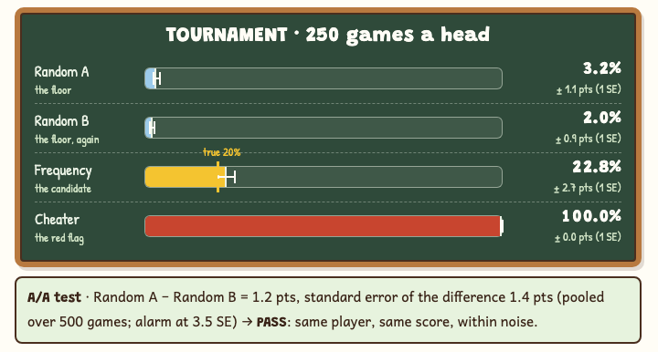

# Reward Arcade

**A hands-on lab for what an RL environment actually is, and why it's the same object as an eval.** Play a real environment in your browser, find the answer sheet in its back panel and seal it, send it the moves a good player never would, watch a farmer beat an honest player under a careless reward, and run a tournament with error bars and an A/A test.

**Play it: https://bakulbadwal.github.io/reward-arcade/**

*Step 3 in seven seconds: the same three players under three reward rules. Under naive partial credit the optimizer picks the Farmer, which never wins a game.*

The environment is an **arcade cabinet**: a sealed box with three controls. `reset()` is the **coin slot**, `step(action)` is the **joystick**, the observation is the **front glass**, `state()` is the **back panel behind the service hatch**, the reward is the **tickets**, and the policy is the **kid at the cabinet**. An eval is the same cabinet with a **scoreboard**. A leak is the **answer sheet taped inside the hatch**; reward hacking is the **ticket jackpot glitch**. Hold that picture and the rest follows, from OpenEnv's three methods to why a robot keeps its simulator in-process.

## What's inside

| Step | You play with | What clicks |
|---|---|---|
| **0 · The cabinet** | The OpenEnv course's own Module 4 word game, running here logic for logic: a coin slot, 26 keys, a ticket tape of every call; a switch between a WebSocket session and one-off HTTP calls | The three methods, and why plain HTTP calls never continue a game: **one connection is one game** |
| **1 · Front glass, back panel** | Sort eight fields between the observation, the state and the server; then let a cheater play 200 games against your layout | The course keeps the secret word in `state`, which the client can fetch. **Anything the client can fetch, the player can see** |
| **2 · Shake the joystick** | Five inputs a good player never sends (a step before a coin, an empty guess, two letters, repeats), and four switches that close the holes | A fresh cabinet pays a **win** for a step before a coin; `''` counts as "in the word"; nothing ends a game of repeats. **An optimizer will send these** |
| **3 · The prize rules** | Three reward rules, three players (Random, Frequency, a Farmer that never wins), a step cap, and the "two games on one word" spread GRPO needs | Under naive partial credit the **Farmer scores 4.9 a game without a single win**; under binary reward nearly every group of 2 is a tie. Pay for progress, cap it, and make sure the player varies |
| **4 · The tournament** | Games per head, a floor, a ceiling, error bars, an A/A test, and ten separate runs against a known truth (Frequency wins exactly 20%) | One run is a sample: at 100 games a 20% player reads anywhere from 14% to 28%. **A hundred percent is a bug report** |
| **5 · Arcade vs pond** | One rollout step's wall time as policy + environment + network, with presets for a Wordle LLM and for Microduck's 4,096 ducks | For an LLM the network hop is noise; for a robot simulator it's ~99% of the step. **Same loop, opposite economics** |
| **★ Review board** | Three broken cabinets (an answer sheet on the glass, a ticket jackpot, free play): name the cause, pick the fix; the tempting wrong fixes fail for stated reasons | You can debug a suspicious score |
| **✓ Field test** | Eight questions answered by operating the widgets | Proof it stuck. Fix all three cabinets and score 6 or better, and the arcade posts your high score |

Each step has predict-then-reveal questions and a "say it out loud" line that unlocks once you've played. Every term has a tooltip with its plain meaning and its arcade equivalent.

## Why it exists

Two sibling labs already cover the learner: [Policy Pond](https://bakulbadwal.github.io/policy-pond/) (REINFORCE, PPO, GAE, for a robot) and [Finishing School](https://bakulbadwal.github.io/finishing-school/) (SFT, DPO, GRPO, for a language model). Neither covers the world the learner practices in. The [OpenEnv course](https://github.com/huggingface/openenv-course) does, but its Module 4 code doesn't run as written and its example game has bugs the course never mentions. Those bugs turned out to be the best lesson in it:

- the secret word is readable through `state()` (a **leak**)
- a step before `reset()` pays a win, and an empty guess is free (holes an **optimizer** will find)
- a repeated correct letter costs nothing and nothing stops the clock (the **farmable** reward in step 3)

This lab runs that game, bugs and all, and lets you close each one. Along the way it makes the case that an environment and an eval are one object: a task, a sandbox, a verifier, and a score, read either by a trainer or by a person.

## Run it

Play it live at the link above, or open `index.html` in a browser. There's no build step, no dependencies, and nothing to install.

## What's exact and what's a teaching model

- **Exact:**
  - the Hangman environment is the course's Module 4 game, logic for logic, including its bugs; its behaviour on the real server (`openenv-core` 0.3.0) was checked call by call before this page was written
  - Frequency's and the Farmer's averages are exact expectations (one game per word over the course's ten words); Frequency wins on exactly two of them
  - the standard errors and the A/A test are the plain binomial formulas
- **Simulated (seeded, so they repeat):**
  - Random's and the Cheater's scores, and the "two games on one word differ" rates
- **Teaching model:**
  - step 5's times are order-of-magnitude defaults on sliders; the arithmetic (one step = policy + environment + network) is the whole model
  - the review board's three cases are composites, not incidents

[`ACCEPTANCE.md`](ACCEPTANCE.md) lists every number the build was checked against. For example: the Farmer averages 4.92 tickets under rule 2 and 0.087 under rule 3, and a first draft of the A/A test false-alarmed 1.7% of the time on a working harness before it was fixed.

## Sources

- Hugging Face, [*Building RL Environments with OpenEnv*](https://github.com/huggingface/openenv-course), Modules 1–5 (commit 57ea985)
- [meta-pytorch/OpenEnv](https://github.com/meta-pytorch/OpenEnv): `core/env_server` (stateless HTTP routes, `max_concurrent_envs`), `core/rubrics`, RFCs 004 and 005; PyPI `openenv-core` 0.3.0
- TRL documentation, [*OpenEnv Integration*](https://huggingface.co/docs/trl/main/en/openenv): `environment_factory`, the reward-function tips, server concurrency
- Pollen Robotics, [`microduck_rl`](https://github.com/pollen-robotics/microduck_rl) (mjlab): 4,096 parallel environments, PPO with GAE
- The local lab behind this page, in the author's OpenEnv study pack: every measured number above

## Files

| File | Role |
|---|---|
| `index.html` | All teaching copy and page structure |
| `js/core.js` | The machine: the environment, the players, the exact and simulated evaluations, the statistics (pure functions, `window.RA`) |
| `js/app.js` | Wires controls to the machine and draws the widgets |
| `js/glossary.js` | Tooltip definitions |
| `js/art/arcade.js` | The seven hand-built SVG cutaway scenes, composed from drawn parts (a cabinet, a kid, a sign, a scoreboard, a pond) |
| `PRODUCT.md`, `DESIGN.md`, `ACCEPTANCE.md` | Product brief, the design system (shared with Inference Kitchen and Finishing School), and the checks |

The seventh Hugging Face learning lab, between [Policy Pond](https://github.com/bakulbadwal/policy-pond) and [Finishing School](https://github.com/bakulbadwal/finishing-school). Built by [Bakul Badwal](https://github.com/bakulbadwal) (UVA Darden MBA '27) with Claude Code.

## License

MIT
